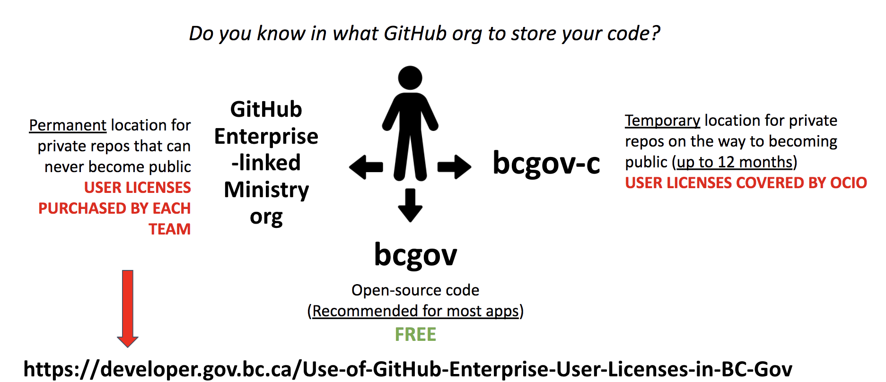

## Introduction To Github and Gov

BC Devops leverages an open social coding and repository hosting platform called [Github](https://github.com). Github incorporates
a platform to share and version control code as well as provides tooling around team/project management, issue tracking,
socialization within the open source community, automation tool integrations and much more.

Github is by far the most popular platform online today (over 31 million users). Many large projects that you may have heard of
are available and hosted on Github including:

- Linux
- VS Code
- Git
- React
- VueJs

The two main organizations within Github for BC Gov are [bcgov](https://github.com/bcgov) and [bcdevOps](https://github.com/bcdevOps).
Between the two organizations, there are over 1000 active projects within the BC Gov Developer Community ! :fire: :fire: :fire: 

## Why are We Using it?

The [new Digital Principles for BC Goverment](https://digital.gov.bc.ca/resources/digital-principles) urge the product teams to "Work in the open" (Principle #5). GitHub is the leading platform for open source projects and allow the Province to harness the collaboration within the open-source community to build software, support innovation, and to save time and money. 

## What organizations does BC Gov have in GitHub?

### `bcgov` org
*Public/private*: **public**

*What is it for*: This org contains **all public code repositories that hold open source code and/or public docs**  for all BC Gov teams working on the Platform including the Platform Services Team.

*Who should use this org*: **all** product teams working in the Private Cloud Openshift Platform

*Who can create repos in this org*: any user who is a member of the `bcgov` org. Any existing member can invite other users to the org using [this online service](https://just-ask-web-bdec76-prod.apps.silver.devops.gov.bc.ca/).

### `bcgov-c` org
*Public/private*: **private**

*What is it for*: This org is used as a **temporary (up to 12 months)** location for the product teams private repos with closed source code and private docs. All repos are expected to be moved to the `bcgov` public org at the end of the period. The **only** permanent private repos allowed in this org are product team's GitOps repos with ArgoCD manifests.

*Who should use this org*: product teams that need a temporary location for their code while they are collecting the approvals necessary to make the code public. The comittment to make the code open-source is required in order to use this org. OCIO covers the user license costs associated with the use of this org by Ministry teams.

*Who can create repos in this org*: Platform Services Team only.  Submit the request to create a repo using [this online service](https://github.com/BCDevOps/devops-requests/issues/new?assignees=caggles%2C+ShellyXueHan%2C+mitovskaol%2C+patricksimonian&labels=github-repo%2C+pending&template=github_repo_request.md&title=). Committment to move the code to a public repo in bcgov org will be required before the request is processed.

### Ministry-specific private orgs
*Public/private*: **private**

*What is it for*: These orgs **must** be linked to the BC Gov's GitHub Enterprise account (user licenses are required for the members of these orgs) and are used as a **permanent location** for teams' private repos with closed-sourced code that cannot be transitioned to a public repo within 12 months. Read the instructions for how to create a private org linked to the corporate GitHub Enterprise account [here](https://developer.gov.bc.ca/Use-of-GitHub-Enterprise-User-Licenses-in-BC-Gov)  

Security Insight feature is available for all orgs linked to the corporate GitHub Enterprise account as well branch protection and code owners for private repos.  Branch protection only allows specific people to push to the protected branch. Code owners feature allows enabling automated reviews, e.g. if a specific user is a code owner of the certain files they are automatically added as PR reviewers and their approval is required before the code can be merged. 
*Who should use this org*: product teams that need a permanent location for their closed sourced code. Each Ministry team must purchase their own [user licenses]((https://developer.gov.bc.ca/Use-of-GitHub-Enterprise-User-Licenses-in-BC-Gov)) in order to use the org. 

*Who can create repos in this org*: Ministry GitHub admins. Consult with your Ministry's IMB to get in touch with the GitHub admins.

### `bcgov-platform-services` org
*Public/private*: **private**

*What is it for*: This org is used by  **Platform Services Team only**  and contains Platform configuration scripts such CCM GitOps manifests (this org allows for the guaranteed amount of GitHub Actions) as well as for managing the `Maintainer` (aka admin) access to the Openshift Platform clusters. All our public repos are contained in `bcgov` org.

*Who should use this org*: Platform Services Team only

*Who can create repos in this org*: Platform Services Team only

Other uses of GitHub:
 - GitHub app integration e.g. SonarCloud testing, a third-party app needs be enabled for each repo individally. The Platform Service Team's approval is required for all third party app integration in all BC Gov's orgs.

## What org should I use for my code?

